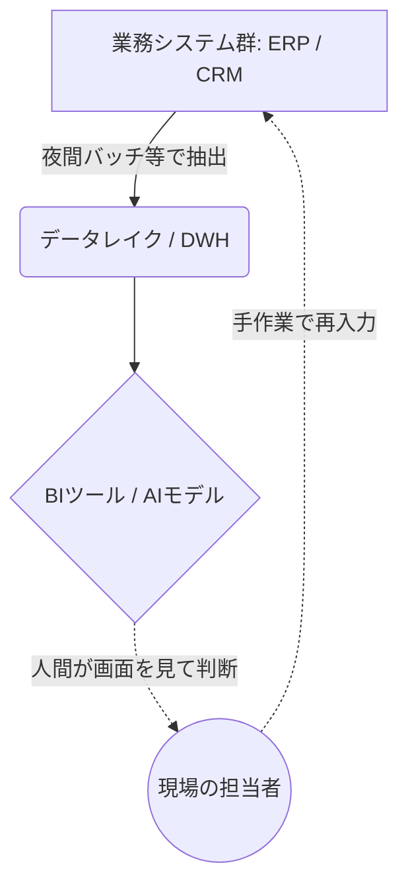
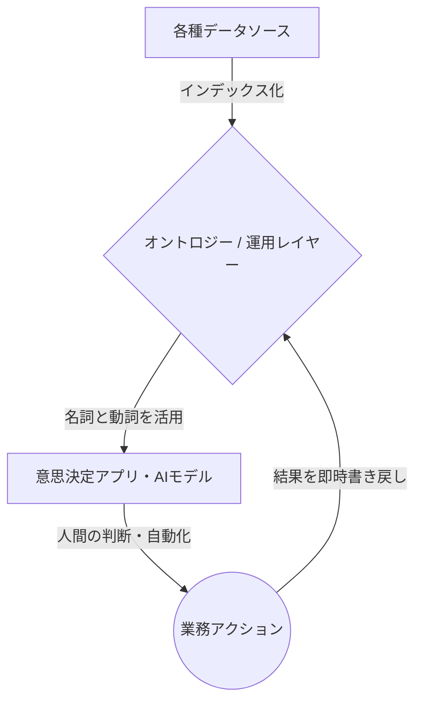
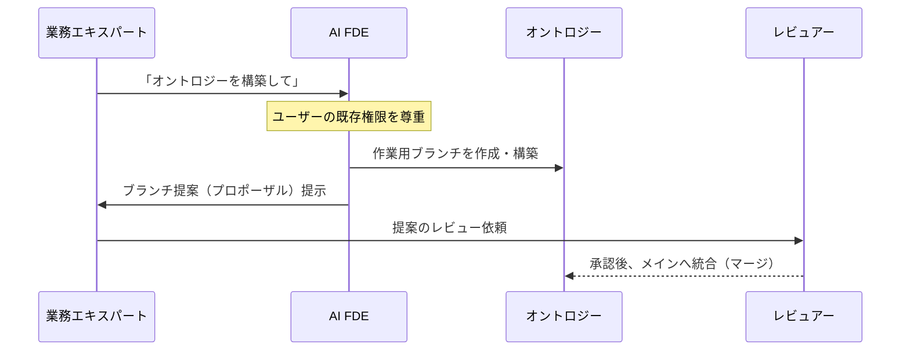
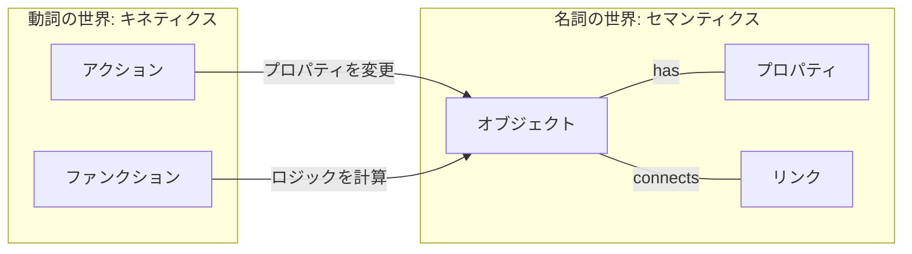
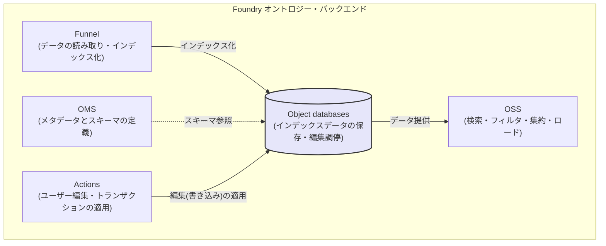

# パランティアの衝撃：データとAIを繋ぐ「オントロジー」戦略 🌐

## Part I: The Problem and the Paradigm（課題とパラダイムシフト）

### 序章：AI時代になぜ「データ統合」は失敗するのか

皆さん、自社のデータ基盤（データレイクやデータウェアハウス）を思い浮かべてみてください。
莫大な予算を投じて構築されたその基盤には、社内のあらゆるシステムからデータが吸い上げられているはずです。その上にはBI（ビジネスインテリジェンス）ツールが被せられ、経営陣向けの美しいダッシュボードが日々更新されています。

しかし、現場の最前線に目を向けると、信じられない光景が広がっていませんか？
「このダッシュボードの売上予測がおかしい。元データはどこだ？」とExcelをバケツリレーする担当者。「AIで需要予測モデルを作ったが、日々の発注システムに連携できず、結局画面を見ながら手入力している」という運用担当者。
データ基盤を入れたにもかかわらず、業務プロセスは分断されたままなのです。

なぜ、このような悲劇が世界中のエンタープライズ企業で繰り返されるのでしょうか？
その根本原因は、私たちがこれまでデータを「分析するための静的なスナップショット（見るためだけのデータ）」としてしか扱ってこなかったことにあります。

上の図が示す通り、従来のシステムアーキテクチャでは、「データを貯めて見せる場所（DWH/BI）」と「業務を実行して書き換える場所（業務システム）」が完全に分断されています。
この構造的な断絶がある限り、どれほど高度なAIモデルを導入しても、最終的なアクションは人間の「手作業（再入力）」に依存し、スケールしません。

#### Palantirがもたらすパラダイムシフト：「オントロジー」という運用レイヤー

本書で解説するPalantir（パランティア）の「オントロジー（Ontology）」戦略は、この根深いサイロ化の病を根本から打ち破るパラダイムシフトです。

知識工学・セマンティックウェブ文脈で広く引用される定義は、Gruber（1993）の「オントロジー＝概念化の明示的仕様」です 。さらに、Studerら（1998）はこれを発展させ「共有された概念化の形式的・明示的仕様」という定義を提示しています 。
しかし、Palantir Foundryにおけるオントロジーは、一般的な“知識表現としてのオントロジー”概念を踏まえつつも、組織の運用（operational）を駆動するための「運用レイヤー／デジタルツイン」として設計されています 。

Foundry公式のバックエンド解説は、Foundryオントロジーを「組織のための運用レイヤー」と位置づけ、データセット等のデジタル資産を現実世界の資産・概念に結び付け、「デジタルツインとして機能」すると説明しています 。

この「見るだけのデータ」から「ビジネスを直接動かすためのデータ」への転換こそが、AI時代における真のデジタルトランスフォーメーションの鍵となります。

---

### 第1章：謎多きユニコーン「Palantir」と真のデータ統合

オントロジーという技術の深淵に触れる前に、まずはこのプラットフォームを生み出した「Palantir」という企業の特異性と、彼らが提供するエコシステムの全体像を理解する必要があります。

#### 1-1. ビジネスを駆動する統合エコシステム：Foundry と AIP

Palantirがどのような価値を提供しているかを知るには、彼らの主力プロダクトを紐解くのが一番の近道です。国内の事例でも、データ・アナリティクス・オペレーションを接続し他システムとも連携するプラットフォームである「Foundry」および、顧客のプライベートネットワークでLLM等を安全に活用するプラットフォームである「AIP」が説明されています 。

アーキテクチャセンターの説明では、Ontology は Palantir アーキテクチャの中核であり、単にデータではなく「企業の複雑で相互接続された意思決定」を表現するために設計されたと述べています 。

#### 1-2. エンタープライズの複雑性に立ち向かう：独自の組織モデル「FDE」

巨大企業のデータ統合は、部門間の対立や無数のレガシーシステムが絡み合う極めて困難なプロジェクトです。Palantirが支持される最大の理由は、優れたソフトウェア以上に、その導入アプローチにあります。

外部分析（Everest Group）によれば、Palantirが自社エンジニアを顧客のオペレーション環境に埋め込み、Palantirスタック上で本番ワークフローを構築し、FDSE（Forward Deployed Software Engineers）が単一顧客に集中してプロダクション品質のワークフローを協働構築する、と説明されています 。

現場で泥臭く高速にシステムを作る一方で、Foundryプラットフォーム上にはガバナンスを維持する設計思想と整合する統制要素が用意されています 。具体的には、Ontology Proposals は、メインバージョンから派生したブランチで変更し、レビュー／承認後にメインへ取り込む仕組みとして説明されています 。さらに Foundry Branching では、ブランチが「単一のオントロジーに紐づく」こと、提案作成・レビュー・マージまでがライフサイクルとして規定されています 。

+1

#### 1-3. AIがエンジニアになる日：AI FDEの衝撃と徹底したガバナンス

さらに驚くべきことに、この「FDE（前線展開）」の概念は人間だけにとどまらず、AIへと拡張されつつあります。
Palantir は、AI FDE（AI-powered forward deployed engineer）として、自然言語要求を Foundry操作へ変換し、データ変換・レポジトリ管理・オントロジー構築/保守などを行う対話型エージェントを提供しています 。

AIがシステムを自動構築すると聞くと暴走を懸念するかもしれませんが、この操作はユーザー既存権限を尊重し、ブランチ提案をレビュー用に提示すると説明されています 。これにより、誤用や機密データの過剰露出リスクを低減しつつ、人間とAIが安全に協働できるのです。

---

### 第2章：Palantirの心臓部「オントロジー」とは何か？

Palantir Foundryを真に理解し、自社のビジネスに革命を起こすためには、「オントロジー」という概念のパラダイムシフトを腹の底から理解する必要があります。本章では、世界を「名詞と動詞」でモデリングする独自のアーキテクチャについて深く掘り下げます。

#### 2-1. データの世界を「名詞」と「動詞」でモデリングする

Palantirのオントロジーが他を圧倒する最大の理由は、セマンティクス（オブジェクト・プロパティ・リンク）と、キネティクス（アクション・ファンクション・動的セキュリティ）を一体化したシステムである点にあります 。

通常、データベース設計は「名詞（データ）」の設計に終始し、「動詞（ビジネスロジックや更新処理）」は別のアプリケーション層に切り離されます。しかしFoundryでは、必要要素をセマンティック要素（オブジェクト、プロパティ、リンク）と運動的要素（アクション、機能、ダイナミックセキュリティ）に分けて明示します 。

**① セマンティック要素（名詞の世界：意味論）**

- **オブジェクトタイプ（Object type）:** 現実世界の概念（名詞）を表す型であり、データソースを入力としてオブジェクトインスタンスを生成します 。
- **プロパティ（Property）:** オブジェクトの属性です 。
- **リンクタイプ（Link type）:** オブジェクトタイプ間の関係であり、1対1/1対多/多対多をサポートします 。
  

**② 運動的要素（動詞の世界：キネティクス）**

- **アクション（Action） / アクションタイプ（Action type）:** Actionは1つ以上のオブジェクトのプロパティ等を変更する単一トランザクションであり、Action typeは実施可能な変更セットと副作用定義を含みます 。
- **ファンクション（Functions）:** 迅速に実行できるロジックを記述し、運用ダッシュボードや意思決定アプリを支えます 。
- **動的セキュリティ（Dynamic security）:** オントロジーの運動的要素として明記されています 。

「見るためのモデル」だけでなく「変えるためのモデル」を同時に作る。更新経路を含めてデータモデルを閉じることで、初めてAIやアプリケーションは、迷うことなく現実世界に対して安全なアクションを実行できるようになるのです。

## Part II: The Architecture of Action（アクションのアーキテクチャ）

### 第3章：【図解】オントロジーを支えるアーキテクチャ

オントロジーは単なる思想上の概念ではなく、極めて堅牢なマイクロサービス群によって物理的に支えられています。現実世界をシステム上でモデリングするためには、「意味論（定義）」と「運動（実行）」を処理する強力なバックエンドが不可欠です。

#### 3-1. アーキテクチャを支える5つの柱

Foundryの公式バックエンド解説では、アーキテクチャ面において Object Storage V2 を中核に、以下の各サービスが明確に責任を分担していることが説明されています 。

- **OMS (Ontology Metadata Service):** オブジェクトタイプ、リンクタイプ、アクションタイプ等の定義を担う包括サービスです 。ここでオントロジーの「意味論（スキーマ）」が決定されます。
- **Object databases:** インデックス化されたデータの保存・クエリ・編集調停を担当する心臓部です 。
- **OSS (Object Set Service):** オントロジーの読み取りを提供し、検索・フィルタ・集約・ロードを可能にするサービスです 。
- **Actions:** 現実世界の変化をシステムに反映させる編集（書き込み）を担います 。複雑な権限・条件を可能にし、履歴的アクションログ作成にも使えると説明されています 。
- **Funnel (Object Data Funnel):** データソースとユーザー編集を読み取り、オブジェクトDBへインデックス化する役割を持っています 。

#### 3-2. 現実世界のインデックス化と物理的制約

データをオントロジー向けインデックスへ変換する「インデックス化」は、Funnelが統括し、バッチ（Funnelバッチ）とストリーミング（Funnelストリーミング）を用途に応じて選択します。
インデックス化は Object Storage V2 を対象とし、Funnel はオブジェクトインスタンスを作成・変更し、データとメタデータを最新に保つパイプラインを調整します。

- **Funnelバッチパイプライン:** データソースやユーザー編集からのデータを効率的にインデックス化する内部ジョブパイプラインです 。
- **Funnelストリーミングパイプライン:** Foundry Streams を入力とし、秒〜分単位での低レイテンシインデックス化を可能にします 。
  
しかし、アーキテクトは物理的な制約も理解する必要があります。ストリーミングオブジェクトタイプには現時点での制限が存在し、ユーザー編集非対応やMDO（マルチデータソースオブジェクト）非対応などが公式に列挙されています 。

---

### 第4章：エンタープライズを支える「ガバナンスとセキュリティ」

データがビジネスの「運用レイヤー」となる時、システム上の変更は直ちに現実世界のビジネスを動かします。そのため、圧倒的なスピードと引き換えに、強固なガバナンスが必要となります。

#### 4-1. データの世界における「ブランチ」とレビュー

Palantirは、ソフトウェア開発における変更管理のベストプラクティスをデータモデルに持ち込みました。運用・ガバナンスの核は、ブランチ／提案（proposal）による変更管理です 。

- **Ontology Proposals:** メインバージョンから派生したブランチで変更し、レビュー／承認後にメインへ取り込む仕組みとして説明されており、プルリクエストに類似しています 。
- **Foundry Branching:** ブランチが「単一のオントロジーに紐づく」こと、そして提案作成・レビュー・マージまでがライフサイクルとして規定されています 。
- **Approvals:** 承認ワークフローはこのアプリが担い、コンプライアンス／ガバナンス／ピアレビューを統合し、「Review ontology proposals」等に使われることが明示されています 。  

#### 4-2. 緻密なアクセス制御と監査性（Action Log）

誰が現実世界を「見れる」のか、そして「変えられる」のか。アクセス制御は組織のセキュリティの要です。

アクセス制御は、制限付きビュー（Restricted Views; RVs）による行レベル制御や、マルチデータソースオブジェクトタイプ（MDO）による列／プロパティレベル制御が公式に説明されています 。さらに、オントロジーリソースの認可モデルは、従来のデータソースに依存した権限から ontology roles へ移行中であることが明示されています 。

また、監査性として極めて重要なのが「アクションログ」です。アクションログはすべてのアクション提出をオブジェクトタイプとしてモデル化し、分析・表示可能にします 。アクションタイプと1対1で対応し、提出ごとにログオブジェクトが作られ、編集対象へ自動リンクされると明記されています 。

---

## Part III: The Destiny of Intelligence（AIと運用が交差する未来）

### 第5章：世界と日本を変えるPalantirのユースケース

オントロジーという「運用レイヤー」が、具体的にどのようにビジネスの力学を変えるのか。公開されている一次資料から、その圧倒的な実績を紐解きます。

#### 5-1. 航空・製造：Airbus（A350生産・Skywise）

PalantirとAirbusのパートナーシップは、製造業におけるデジタルツインの金字塔です。

- **A350生産の加速:** A350が「500万部品」から成り、複数国・複数工場・多数チームにまたがる分散データ（スケジュール等）が課題でした 。これらの情報をFoundryへ統合することで、A350納入（delivery）を33%加速したと記述されています 。
  
- **航空データプラットフォーム「Skywise」:** 業界のデータをセキュアに接続し、100社超の航空会社で利用されています 。航空機あたり最大20,000センサーから得られる毎秒20〜100データポイントというペタバイト級データを扱う規模感が記述されています 。
  

#### 5-2. 保険・介護：SOMPO（日本）

日本国内においても、オントロジーは社会インフラの最適化に貢献しています。 SOMPOが複数子会社で Foundry を利用し、介護施設での活用（ケア支援、政府報告等）や、損保ジャパンの保険金請求プロセス刷新（不正検知、請求トリアージ等）での活用が述べられています 。また、日本国内で8,000人以上が積極的に利用している規模感も言及されています 。

#### 5-3. 日本のエコシステム：富士通×Palantir

富士通のプレスリリース（2023年12月）では、富士通とPalantir Japanがグローバルパートナーシップ発展の契約を締結したことが説明されています 。データ・アナリティクス・オペレーションを接続するFoundryと、顧客のプライベートネットワークでLLM等を安全に活用するAIPについて注記付きで説明されています 。

---

### 第6章：オントロジー×AIがもたらす未来

AI、特に大規模言語モデル（LLM）の登場は、オントロジーの価値をさらに高めています。LLMは優れた知能を持ちますが、現実世界を操作する「手足」を持っていません。

Palantirは、AI FDE（AI-powered forward deployed engineer）として、自然言語要求を Foundry操作へ変換し、オントロジー構築や保守などを行う対話型エージェントを提供しています。
AI FDEは操作においてユーザー既存権限を尊重し、モデルに公開するツール・データを選べること、またブランチ提案をレビュー用に提示することが説明されています。

オントロジーによる厳格な構造化とアクセス権限を土台にすることで、AIはコンテキスト汚染を避けながら、初めて「安全に現実世界のアクションを実行」できるようになります 。

---

### 終章：オントロジー思考で組織のデータを設計せよ

私たちは今、「データを見る時代」から「データが意思決定を直接駆動する時代」への転換点に立っています。オントロジーを構築することは、自社のビジネスを「名詞」と「動詞」で再定義し、組織全体の共通言語を作ることです 。

#### 実装に向けた段階的カリキュラム（アクションプラン）

公式資料に基づく学習ロードマップとして、以下の段階的設計が合理的です 。

| **段階** | **到達目標** | **具体演習（例）** |
| --- | --- | --- |
| **1. Foundry構造理解** | OMS/OSS/Funnel/Actions/Object databases等のバックエンドと権限の理解。 | Object backendやBranching等の一次資料精読。 |
| **2. モデリング入門** | 小さなドメインでObject/Link/Actionを一貫設計する。 | Object type＋Link type＋Action type（提出基準含む）を作り、レビュー用Proposalを作成する。 |
| **3. データ接続・インデックス化** | データソース→Funnel→OSv2→検索/集約の流れを体験する。 | バッチ/ストリーミングの違いと制限を踏まえてインデックス化を検証する。 |
| **4. 書き込み・監査** | Action更新・ログ化・永続化/実体化の運用設計。 | Action logを有効化し、編集反映から実体化の流れを確認する。 |
| **5. API/アプリ実装** | OSDK（Ontology SDK）で読み書きできる小アプリを作る。 | Developer ConsoleでOSDKを生成し、目的とトークン制御を理解する。 |

データは、それを活用する人々の意思と繋がったとき、初めて「衝撃」をもたらします。オントロジーという新たな羅針盤を手に、あなたの組織のデータを「死んだ記録」から「生きたエンジン」へと変革してください。

