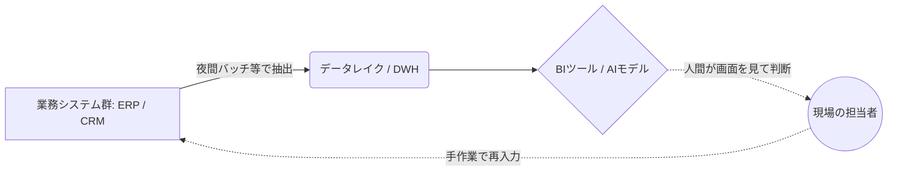
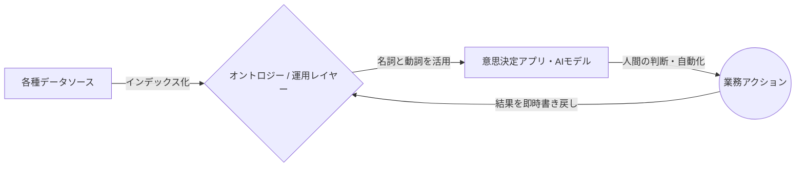
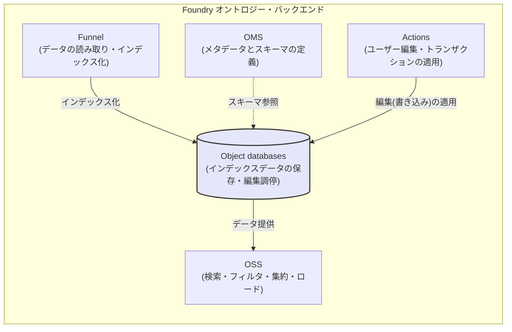
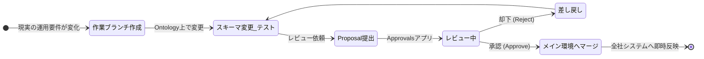
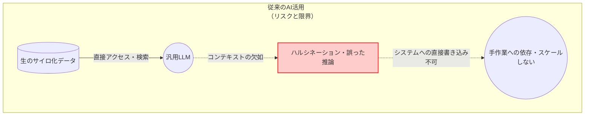
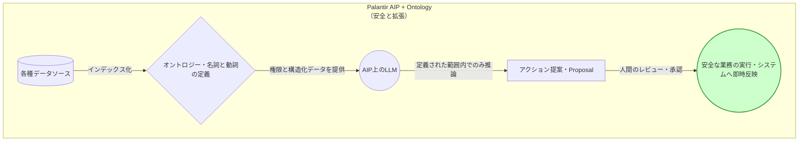
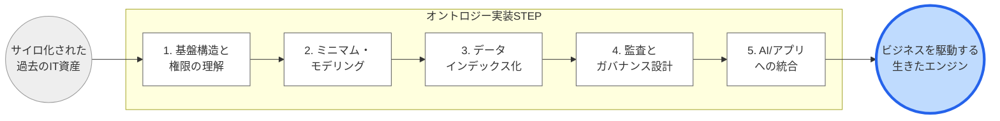

# パランティアの衝撃：データとAIを繋ぐ「オントロジー」戦略 🌐

## Part I: The Problem and the Paradigm（課題とパラダイムシフト）

### 序章：AI時代になぜ「データ統合」は失敗するのか

皆さん、自社のデータ基盤（データレイクやデータウェアハウス）を思い浮かべてみてください。 
莫大な予算を投じて構築されたその基盤には、社内のあらゆるシステムからデータが吸い上げられているはずです。 
その上にはBI（ビジネスインテリジェンス）ツールが被せられ、経営陣向けの美しいダッシュボードが日々更新されています。 

しかし、現場の最前線に目を向けると、信じられない光景が広がっていませんか？ 
「このダッシュボードの売上予測がおかしい。元データはどこだ？」とExcelをバケツリレーする担当者。 
「AIで需要予測モデルを作ったが、日々の発注システムに連携できず、結局画面を見ながら手入力している」という運用担当者。 
データ基盤を入れたにもかかわらず、業務プロセスは分断されたままなのです。 

なぜ、このような悲劇が世界中のエンタープライズ企業で繰り返されるのでしょうか？ 
その根本原因は、私たちがこれまでデータを「分析するための静的なスナップショット（見るためだけのデータ）」としてしか扱ってこなかったことにあります。 

上の図が示す通り、従来のシステムアーキテクチャでは、「データを貯めて見せる場所（DWH/BI）」と「業務を実行して書き換える場所（業務システム）」が完全に分断されています。 
この構造的な断絶がある限り、どれほど高度なAIモデルを導入しても、最終的なアクションは人間の「手作業（再入力）」に依存し、スケールしません。 

#### Palantirがもたらすパラダイムシフト：「オントロジー」という運用レイヤー

本書で解説するPalantir（パランティア）の「オントロジー（Ontology）」戦略は、この根深いサイロ化の病を根本から打ち破るパラダイムシフトです。 

知識工学・セマンティックウェブ文脈で広く引用される定義は、Gruber（1993）の「オントロジー＝概念化の明示的仕様」です。 
さらに、Studerら（1998）はこれを発展させ「共有された概念化の形式的・明示的仕様」という定義を提示しています。 
しかし、Palantir Foundryにおけるオントロジーは、一般的な“知識表現としてのオントロジー”概念を踏まえつつも、組織の運用（operational）を駆動するための「運用レイヤー／デジタルツイン」として設計されています。 

Foundry公式のバックエンド解説は、Foundryオントロジーを「組織のための運用レイヤー」と位置づけ、データセット等のデジタル資産を現実世界の資産・概念に結び付け、「デジタルツインとして機能」すると説明しています。 

この「見るだけのデータ」から「ビジネスを直接動かすためのデータ」への転換こそが、AI時代における真のデジタルトランスフォーメーションの鍵となります。 

---

### 第1章：謎多きユニコーン「Palantir」の正体と真のデータ統合

「オントロジー」という技術の深淵（第2章以降）に触れる前に、そもそも「Palantir」とは何者なのかを知る必要があります。 
彼らはAWSやSnowflakeのような一般的なクラウドベンダーとも、SalesforceのようなSaaS企業とも全く異なる特異なDNAを持っています。 

#### 1-1. 秘密のベールに包まれた出自：CIAと戦場から生まれたDNA

Palantir Technologiesは2003年、ピーター・ティール（PayPal共同創業者）や現在CEOを務めるアレックス・カープらによって設立されました。 
初期の主要な投資家には、CIA（米国中央情報局）のベンチャーキャピタル部門であるIn-Q-Telが名を連ねています。 

彼らが最初に開発したプラットフォーム「Palantir Gotham（ゴッサム）」は、テロリストのネットワーク追跡やサイバーセキュリティなど、米国防総省や情報機関の極秘任務のために構築されました。 
戦場や諜報の最前線では、「データのサイロ化」や「システム間の連携不足」は単なる非効率ではなく、 **「人命の喪失」や「国家の危機」に直結する致命的な欠陥** となります。 
あらゆる形式の断片的なデータを繋ぎ合わせ、瞬時に全体像を把握し、即座に次の作戦（アクション）へと移行する。 
Palantirの強烈な「運用（オペレーション）」と「ガバナンス」への執着は、この極限環境で鍛え上げられたものなのです。 

#### 1-2. 「データの箱」ではなく「組織のOS」：既存ITベンダーとの決定的差異

一般的なITエコシステムの中で、Palantirは独自のポジションを確立しています。 

- **インフラ / DWHベンダー（AWS, Google Cloud, Snowflake等）との違い：**
彼らは「データを安く大量に保存・計算する箱（土台）」を提供します。 
しかし、その箱の中のデータをどう使ってビジネスを動かすかは顧客に委ねられています。 
Palantirはこれらの箱を置き換えるのではなく、その上に被さり「データを意思決定と行動に変換するレイヤー」として機能します。 
  
- **業務SaaS（Salesforce, SAP等）との違い：**
SaaSは「営業」や「人事」といった特定部門の業務を劇的に効率化します。 
しかし、部門ごとに最適化されたSaaSが増えるほど、企業全体としてはデータがサイロ化していきます。 
Palantirは、これら点在するSaaSやレガシーシステムからデータを統合し、組織全体を俯瞰する「単一のOS」を提供します。 
  

#### 1-3. 戦場からエンタープライズへ：FoundryとAIPの誕生

国防・諜報機関で培われたこの圧倒的なデータ統合・解析のノウハウを、民間企業（製造、金融、ヘルスケア、サプライチェーン等）の複雑なオペレーションに適用するために生み出されたのが、本書の主役である **「Palantir Foundry（ファウンドリー）」** です。 

アーキテクチャセンターの説明では、オントロジーはPalantirアーキテクチャの中核であり、単にデータを整理するのではなく「企業の複雑で相互接続された意思決定」を表現するために設計されたと述べています。 

そして現在、このFoundryの強固なオントロジー基盤の上に、最新の大規模言語モデル（LLM）を安全に統合するためのプラットフォーム **「AIP（AI Platform）」** が展開されています。 
AIPは顧客のプライベートネットワーク内で機能し、AIが現実のビジネスを安全に実行できる環境を提供しています。 

#### 1-4. エンタープライズの複雑性に立ち向かう：独自の組織モデル「FDE」

巨大企業のデータ統合は、部門間の対立や無数のレガシーシステムが絡み合う極めて困難なプロジェクトです。 
Palantirが支持される最大の理由は、優れたソフトウェア以上に、その導入アプローチにあります。 

外部分析（Everest Group）によれば、Palantirが自社エンジニアを顧客のオペレーション環境に直接埋め込み、Palantirスタック上で本番ワークフローを構築し、 
FDSE（Forward Deployed Software Engineers：前線展開エンジニア）が単一顧客に集中してプロダクション品質のワークフローを協働構築する、と説明されています。 

現場で泥臭く高速にシステムを作る一方で、Foundryプラットフォーム上にはガバナンスを維持する設計思想が組み込まれています。 
具体的には、Ontology Proposalsはメインバージョンから派生したブランチで変更し、レビュー／承認後にメインへ取り込む仕組み（プルリクエストに類似）として説明されています。 
さらに Foundry Branching では、ブランチが「単一のオントロジーに紐づく」こと、提案作成・レビュー・マージまでがライフサイクルとして厳格に規定されています。 

#### 1-5. AIがエンジニアになる日：AI FDEの衝撃と徹底したガバナンス

さらに驚くべきことに、この「FDE（前線展開）」の概念は人間だけにとどまらず、AIへと拡張されつつあります。 

Palantir は、AI FDE（AI-powered forward deployed engineer）として、自然言語の要求をFoundry操作へ変換し、データ変換パイプラインの作成・レポジトリ管理・オントロジー構築や保守などを行う対話型エージェントを提供しています。 

AIがシステムを自動構築すると聞くと暴走を懸念するかもしれませんが、この操作は「ユーザーの既存権限を尊重」し、「ブランチ提案を必ずレビュー用に提示する」よう設計されています。 
これにより、誤用や機密データの過剰露出リスクを極限まで低減しつつ、人間とAIが安全に協働できるのです。 

---

### 第2章：Palantirの心臓部「オントロジー」とは何か？

Palantir Foundryを真に理解し、自社のビジネスに革命を起こすためには、「オントロジー」という概念のパラダイムシフトを腹の底から理解する必要があります。 
本章では、世界を「名詞と動詞」でモデリングする独自のアーキテクチャについて深く掘り下げます。 

#### 2-1. データの世界を「名詞」と「動詞」でモデリングする

Palantirのオントロジーが他を圧倒する最大の理由は、セマンティクス（オブジェクト・プロパティ・リンク）と、 
キネティクス（アクション・ファンクション・動的セキュリティ）を一体化したシステムである点にあります。 

通常、データベース設計は「名詞（データ）」の設計に終始し、「動詞（ビジネスロジックや更新処理）」は別のアプリケーション層に切り離されます。 
しかしFoundryでは、必要要素をセマンティック要素（オブジェクト、プロパティ、リンク）と運動的要素（アクション、機能、ダイナミックセキュリティ）に分けて明示します。 

**① セマンティック要素（名詞の世界：意味論）**

- **オブジェクトタイプ（Object type）:** 現実世界の概念（名詞）を表す型であり、データソースを入力としてオブジェクトインスタンスを生成します 。
- **プロパティ（Property）:** オブジェクトの属性です 。
- **リンクタイプ（Link type）:** オブジェクトタイプ間の関係であり、1対1/1対多/多対多をサポートします 。
  

**② 運動的要素（動詞の世界：キネティクス）**

- **アクション（Action） / アクションタイプ（Action type）:** Actionは1つ以上のオブジェクトのプロパティ等を変更する単一トランザクションであり、Action typeは実施可能な変更セットと副作用定義を含みます 。
- **ファンクション（Functions）:** 迅速に実行できるロジックを記述し、運用ダッシュボードや意思決定アプリを支えます 。
- **動的セキュリティ（Dynamic security）:** オントロジーの運動的要素として明記されています 。

「見るためのモデル」だけでなく「変えるためのモデル」を同時に作る。 
更新経路を含めてデータモデルを閉じることで、初めてAIやアプリケーションは、迷うことなく現実世界に対して安全なアクションを実行できるようになるのです。 

## Part II: The Architecture of Action（アクションのアーキテクチャ）

### 第3章：【図解】オントロジーを支えるアーキテクチャ

オントロジーは単なる思想上の概念ではなく、極めて堅牢なマイクロサービス群によって物理的に支えられています。 
現実世界をシステム上でモデリングするためには、「意味論（定義）」と「運動（実行）」を処理する強力なバックエンドが不可欠です。 

#### 3-1. アーキテクチャを支える5つの柱

Foundryの公式バックエンド解説では、アーキテクチャ面において Object Storage V2 を中核に、以下の各サービスが明確に責任を分担していることが説明されています 。 

- **OMS (Ontology Metadata Service):** オブジェクトタイプ、リンクタイプ、アクションタイプ等の定義を担う包括サービスです 。ここでオントロジーの「意味論（スキーマ）」が決定されます。
- **Object databases:** インデックス化されたデータの保存・クエリ・編集調停を担当する心臓部です 。
- **OSS (Object Set Service):** オントロジーの読み取りを提供し、検索・フィルタ・集約・ロードを可能にするサービスです 。
- **Actions:** 現実世界の変化をシステムに反映させる編集（書き込み）を担います 。複雑な権限・条件を可能にし、履歴的アクションログ作成にも使えると説明されています 。
- **Funnel (Object Data Funnel):** データソースとユーザー編集を読み取り、オブジェクトDBへインデックス化する役割を持っています 。

#### 3-2. 現実世界のインデックス化と物理的制約

データをオントロジー向けインデックスへ変換する「インデックス化」は、Funnelが統括し、バッチ（Funnelバッチ）とストリーミング（Funnelストリーミング）を用途に応じて選択します。 
インデックス化は Object Storage V2 を対象とし、Funnel はオブジェクトインスタンスを作成・変更し、データとメタデータを最新に保つパイプラインを調整します。 

- **Funnelバッチパイプライン:** データソースやユーザー編集からのデータを効率的にインデックス化する内部ジョブパイプラインです。
- **Funnelストリーミングパイプライン:** Foundry Streams を入力とし、秒〜分単位での低レイテンシインデックス化を可能にします。
  
しかし、アーキテクトは物理的な制約も理解する必要があります。 
ストリーミングオブジェクトタイプには現時点での制限が存在し、ユーザー編集非対応やMDO（マルチデータソースオブジェクト）非対応などが公式に列挙されています。 

---

### 第4章：エンタープライズを支える「ガバナンスとセキュリティ」

データがビジネスの「運用レイヤー」となる時、システム上の変更は直ちに現実世界のビジネスを動かします。 
分析用のダッシュボードであれば、データが間違っていても「グラフがおかしい」で済みますが、オントロジーを通じて発注やステータス変更が自動化されている環境では、 
一つの誤作動が「不要な部品を1万個誤発注する」「工場の生産ラインを止める」といった致命的な実害（インシデント）に直結します。 

圧倒的なスピードで現実を書き換える力を持つからこそ、Palantirは一般的なITツールを遥かに凌駕する強固なガバナンスとフェイルセーフの仕組みをプラットフォームの根底に組み込んでいます。 

#### 4-1. セキュリティのパラダイムシフト：「見せない」から「安全に動かす」へ

従来のエンタープライズITにおけるセキュリティとは、主に「データを見せないこと（アクセス制限・暗号化）」を指していました。 
しかし、オントロジー駆動型アーキテクチャにおいては、セキュリティの定義が「現実世界に対する誤った変更・破壊を防ぐこと」へと次元が引き上がります。 

誰が、どのデータをもとに、どのようなビジネスロジック（アクション）を実行できるのか。 
この「運動的要素（キネティクス）」に対する厳密な統制こそが、Foundryが軍事・諜報機関から受け継いできた強靭なガバナンスの正体です。 

#### 4-2. データの世界における「ブランチ」とレビューのライフサイクル

Palantirは、ソフトウェアエンジニアリングにおいて歴史的に証明された「バージョン管理」と「ピアレビュー」のベストプラクティスを、データモデルと現実の運用プロセスに直接持ち込みました。 
その核となるのが、**ブランチ（Branching）** と **提案（Proposal）** の仕組みです。 

* **Ontology Proposals（提案と承認のプロセス）:**
現実の運用ルール（オントロジーのスキーマ定義やアクションの挙動）を変更する際、エンジニアであっても直接本番環境を書き換えることはできません。 
メインバージョンから派生した「作業用ブランチ」上で安全に変更を加え、テストを行い、レビューと承認（Approve）を経て初めてメイン環境へ取り込まれます。 
これは開発現場で日常的に行われるプルリクエスト（Pull Request）の概念をデータ運用に適用したものです。 
* **Foundry Branchingの厳格な適用:**
ブランチは「単一のオントロジーに紐づく」ものとして一元管理されます。 
提案作成からレビュー、マージに至るまでのライフサイクルがプラットフォームレベルで強制されるため、特定の担当者によるシャドーITや、無許可の運用変更を構造的に排除できます。 

#### 4-3. 複雑な組織を支える「Approvals アプリ」

巨大なエンタープライズ企業では、「誰が承認権限を持っているのか」自体が複雑です。 
部門長、コンプライアンス担当、データオーナーなど、多岐にわたるステークホルダーの合意形成を支援するため、Foundryには専用の「Approvals」アプリが用意されています。 

このアプリは、承認ワークフローを一元管理し、ピアレビューやコンプライアンスチェックをシームレスに統合します。 
これにより、「いつ、誰が、どのような理由でその変更を承認したのか」というプロセス自体が完全に透明化されます。 

#### 4-4. 緻密なアクセス制御と究極の監査トレール「Action Log」

「見せる/見せない」の制御と「誰が何をしたか」の記録も、従来型DWHとは比較にならない解像度で実装されています。 

- **制限付きビュー（RVs）とMDOによる制御:**
アクセス制御は、制限付きビュー（Restricted Views; RVs）による「行レベル」の制御に留まりません。 
マルチデータソースオブジェクトタイプ（MDO）による「列／プロパティレベル」の制御も公式にサポートされています。 
これにより、「顧客の購買履歴は全社で共有するが、個人を特定する名前や電話番号は特定部門しか見れない」といった緻密な統制が可能です。 
また、データソースに依存した権限管理から、オントロジーの役割（ontology roles）ベースの認可モデルへと移行が進んでいます。 
  
- **究極の監査トレール「アクションログ」:**
ガバナンスの最後の砦がアクションログです。 
Foundryでは、すべてのアクション提出が「それ自体がオブジェクトタイプ」としてモデル化され、永続的に記録されます。 
アクションタイプと1対1で対応し、誰が、いつ、どのデータを書き換えたのかというログオブジェクトが提出ごとに自動生成され、編集対象のオブジェクトへと自動リンクされます。 
これにより、完全なトレーサビリティ（追跡可能性）が半永久的に担保されます。   

---

## Part III: The Destiny of Intelligence（AIと運用が交差する未来）

### 第5章：世界と日本を変えるPalantirのユースケース

オントロジーという「運用レイヤー」が、具体的にどのようにビジネスの力学を変えるのか。 
国防の極限環境から生まれたこのプラットフォームは、現在、グローバル企業から日本のインフラ企業に至るまで、極めて現実的なビジネス課題を解決しています。 
公開されている一次資料から、その圧倒的な実績の解像度を上げます。 

#### 5-1. 航空・製造：Airbus（500万部品のデジタルツインとSkywise）

Palantirと欧州航空機大手Airbusのパートナーシップは、製造業におけるオントロジー活用の金字塔です。 
彼らが直面していたのは、まさに「サイロ化の限界」でした。 

- **A350生産の劇的な加速:**
最新鋭機A350は、約500万個の部品から成り、欧州の複数国、複数工場、無数のサプライヤーとチームにまたがって製造されます。 
以前は、部品の遅延や品質課題などのデータが各地に分散し、誰も「航空機完成までの全体像」を把握できていませんでした。 
これらの分散データをFoundryのオントロジーへと統合し、全部品とスケジュールの関係性をリンクさせることで、 
ボトルネックの特定と優先順位付けが可能となり、A350の納入（delivery）を33%も加速させることに成功しました。 
  
- **業界標準プラットフォーム「Skywise」への進化:**
自社の製造革命にとどまらず、AirbusはPalantirと共に航空業界全体を巻き込むプラットフォーム「Skywise」を構築しました。 
現在、100社を超える航空会社がこの基盤を利用し、航空機1機あたり最大20,000個のセンサーから得られる「毎秒20〜100データポイント」というペタバイト級の時系列データをオントロジー上で処理しています。 
これにより、部品の故障予測や予防保守が可能になり、欠航リスクを劇的に低減させています。 
  

#### 5-2. 保険・介護：SOMPO（リアルデータプラットフォームの構築）

日本国内においても、オントロジーは社会インフラの最適化というミッションに深く浸透しています。 
SOMPOホールディングスは、「リアルデータプラットフォーム（RDP）」構想の中核としてPalantirを採用しました。 

- **介護現場のデジタルトランスフォーメーション:**
SOMPOケアが運営する介護施設において、利用者の健康状態、スタッフのシフト、ケア記録などをFoundryに統合。 
単なるデータ収集ではなく、現場スタッフが次の最適なアクション（ケア支援や緊急対応）を判断するための意思決定支援として活用されています。 
  
- **損保ジャパンにおける業務プロセスの刷新:**
保険金請求プロセスにおいて、オントロジーを用いた不正検知や、請求案件のトリアージ（優先順位付け）システムを構築。 
日本国内で8,000人以上が日常業務としてこのプラットフォームを積極的に利用しており、現場の「手作業」をオントロジー上の「アクション」へと置き換えることに成功しています。 
  

#### 5-3. 日本のエンタープライズエコシステム：富士通×Palantir

さらに、日本特有のレガシーシステム環境を打破するため、強力なパートナーシップが結ばれています。 
富士通のプレスリリース（2023年12月）では、富士通とPalantir Japanがグローバルパートナーシップを発展させたことが強調されています。 

日本の大企業の多くは、クラウド化への懸念からデータをオンプレミスやプライベートネットワークに閉じ込めています。 
ここで活きるのが、顧客の閉域網でLLMを安全に活用する「AIP（AI Platform）」と「Foundry」の組み合わせです。 
データ・アナリティクス・オペレーションを接続するこの基盤により、セキュリティ要件の厳しい日本の金融機関や官公庁、製造業においても、真のデータ駆動型ビジネスの社会実装が急速に進みつつあります。 

---

### 第6章：オントロジー×AIがもたらす未来

現在、世界中の企業が「生成AI（LLM）の自社導入」に奔走しています。 
しかし、その多くが「社内チャットボット」や「議事録の要約」といった表面的な効率化にとどまっています。 
その理由は明確です。AIが、現実のビジネスを動かすための「共通言語（オントロジー）」と「手足（アクション）」を持っていないからです。 

#### 6-1. LLMの限界と「意味論」の壁によるハルシネーションの封じ込め

大規模言語モデル（LLM）は卓越した推論能力と自然言語処理能力を持ちますが、「顧客のA社の在庫が尽きそうだから、B倉庫から100個出荷する」というような、現実のシステム操作を直接行うことはできません。 
また、社内規程や複雑な業務文脈を理解しきれず、ハルシネーション（もっともらしい嘘）を引き起こすリスクが常に付きまといます。 

ここで、オントロジーがAIの「堅牢な土台」として機能します。 
FoundryのAIP（AI Platform）環境下では、AIは「生の雑多なデータ」ではなく、「名詞（オブジェクト）」と「動詞（アクション）」として厳密に定義・構造化されたオントロジーを読み込みます。 
AIは「定義されたアクション」の範囲内でしか推論・提案を行えないため、コンテキスト汚染やハルシネーションを極限まで排除し、安全に現実世界のアクションを実行できるようになります。 

#### 6-2. AIエージェント（AI FDE）による運用構築コストの消滅

さらにPalantirは、AIを単なる「ユーザーの補助ツール」から、「システムを自ら構築するエンジニア（AI FDE）」へと昇華させました。 

これまでのデータ統合基盤構築は、データエンジニアが膨大な時間をかけてデータソースを繋ぎ、マッピングし、パイプラインを構築する泥臭い作業が必要でした。 
しかし、AI-powered forward deployed engineer（対話型エージェント）の登場により、世界は一変します。 
ユーザーが「新規のCRMデータから顧客オントロジーを構築して」と自然言語で要求するだけで、AIがそれをFoundryの操作コマンドへ変換し、データパイプラインの作成やオントロジー保守を自動で代行するのです。 

#### 6-3. 「人間とAIの共進化」を支えるプラットフォーム

AIにシステムを作らせることは危険でしょうか？ いいえ、Palantirのアーキテクチャがそれを防ぎます。 

AI FDEはユーザーの既存権限を厳格に尊重し、モデルに公開するツール・データを選択させます。 
そして、変更を加える際には必ず「ブランチ提案（Proposal）」を作成し、人間のレビュー用に提示します。 

人間は「データの繋ぎ込み」という退屈な作業から解放され、AIが構築したオントロジーや提案したアクションに対して「それがビジネスの意図に合致しているか」をレビュー・承認する高度な役割へとシフトします。 
オントロジーという共通言語があるからこそ、人間とAIは初めて安全かつ対等に協働し、ビジネスをスケーラブルに進化させることができるのです。 

---

### 終章：オントロジー思考で組織のデータを設計せよ

私たちは今、「データを見る時代」から「データが意思決定を直接駆動する時代」への決定的な転換点に立っています。 

AIがどれほど賢くなっても、企業が持つデータが「サイロ化されたシステムの残骸」である限り、その知性はビジネスの現場には届きません。 
オントロジーを構築することは、単なるITシステムの導入ではありません。 
自社のビジネスを「名詞」と「動詞」で再定義し、人間とAI、そしてシステムが対話するための「組織全体の共通言語」を作ることと同義です。 

#### 実装に向けた段階的カリキュラム（アクションプラン）

オントロジー駆動型アーキテクチャの構築は、壮大に見えても一歩ずつ確実に進めることができます。 
公式資料に基づく学習・実装ロードマップとして、以下の段階的アプローチを推奨します。 

1. **基盤構造と権限モデルの理解（Month 1）** まずは、OMS / OSS / Funnel / Actions / Object databasesといったバックエンドコンポーネントの役割を理解します。同時に、RVs（制限付きビュー）やontology rolesといったPalantir独自の権限モデルを学び、ガバナンスの基礎を固めます。
  
2. **ミニマム・モデリングとブランチ運用（Month 2）** 特定の小さなドメイン（例：単一の製品ラインの在庫管理など）で、Object / Link / Actionを実際に設計します。ここでは、アクションの提出基準や副作用を含めて定義し、Proposal（提案）を作成してレビュー・承認するプロセスを体感することが重要です。
  
3. **データパイプラインの実証（Month 3）** データソースからFunnelを経由し、OSv2へとインデックス化され、検索や集約が可能になるデータフローを構築します。バッチ処理とストリーミング処理の違いや、それぞれの物理的制限を踏まえた上で、実運用に耐えうるデータの鮮度と安定性を検証します。
  
4. **監査とガバナンスのルールの設計（Month 4）** Actionによる更新、アクションログの生成、そして実体化（永続化）への運用ルールを設計します。アクションログ機能を有効化し、誰が編集した内容がどのように本番データへ反映・追跡されるか、自社のコンプライアンス要件と照らし合わせます。
  
5. **AIおよび外部アプリケーションへの統合（Month 5〜）** 完成したオントロジーを、外部システムやAIP、カスタムアプリケーションから安全に読み書き可能な状態にします。Developer ConsoleでOSDK（Ontology SDK）を生成し、適切なトークン制御の下で、実際のビジネスアプリからオントロジーを駆動させます。
  

データは、それを活用する人々の意思と繋がり、現実のアクションへと変換されたとき、初めて社会に「衝撃（インパクト）」をもたらします。 
分析結果を眺めるだけの過去のIT資産から脱却し、オントロジーという新たな羅針盤を手に、あなたの組織のデータを「死んだ記録」から「ビジネスを駆動する生きたエンジン」へと変革してください。 

