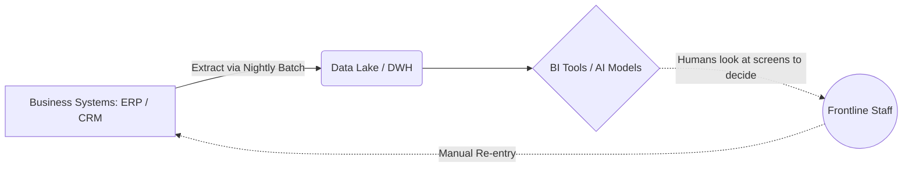
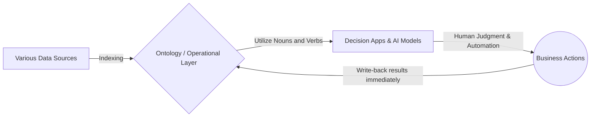
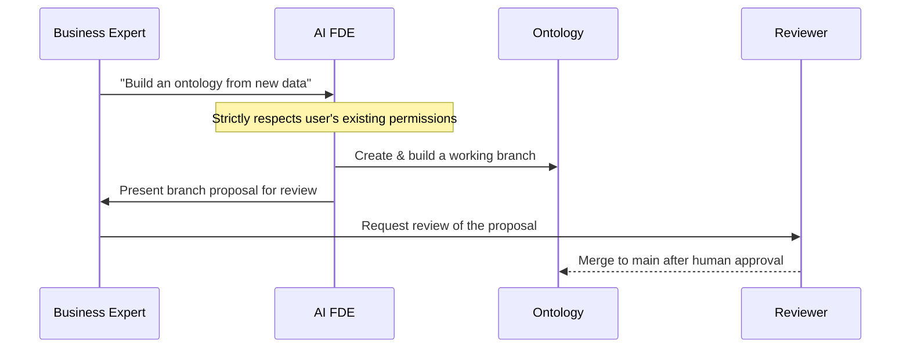
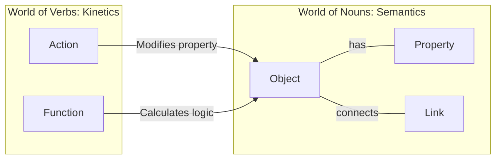
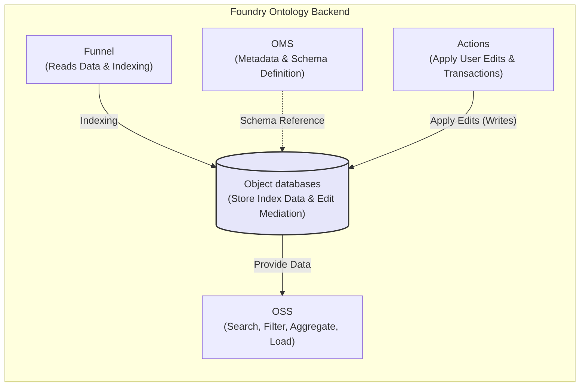
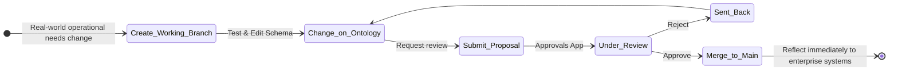
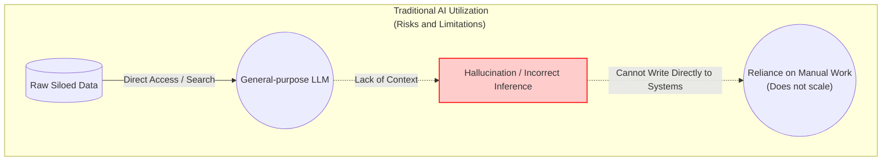
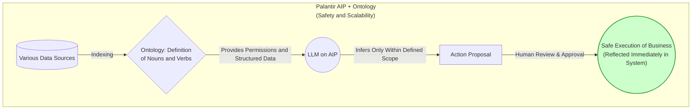
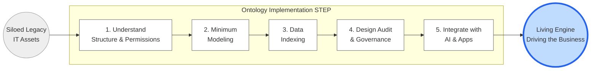

# The Palantir Impact: Ontology Strategy Connecting Data and AI 🌐

## Part I: The Problem and the Paradigm

### Prologue: Why "Data Integration" Fails in the AI Era

Think about your company's data infrastructure (Data Lakes or Data Warehouses). 
Huge budgets have been spent to suck data from every system in the company into this infrastructure. 
On top of that, BI (Business Intelligence) tools are layered, and beautiful dashboards for executives are updated daily. 

However, if you look at the front lines of the business, an unbelievable scene unfolds. 
"The sales forecast on this dashboard is wrong. Where is the raw data?" asks a manager passing Excel files around. 
"We built a demand forecasting model with AI, but it can't link to the daily ordering system, so I end up typing it in manually while looking at the screen," sighs an operations staff member. 
Despite implementing a data infrastructure, business processes remain fragmented. 

Why does this tragedy repeat itself in enterprise companies worldwide? 
The root cause is that we have historically treated data only as **"static snapshots for analysis (data just for viewing)."** 

As the diagram above shows, in traditional system architectures, the "place to store and show data (DWH/BI)" and the "place to execute business and write changes (Business Systems)" are completely disconnected.

As long as this structural disconnect exists, no matter how advanced the AI models introduced are, the final action relies on human "manual work (re-entry)" and cannot scale.

#### The Paradigm Shift Brought by Palantir: Ontology as an Operational Layer

The **"Ontology"** strategy by Palantir, explained in this book, is a paradigm shift that fundamentally breaks this deep-rooted disease of silos.

In the context of knowledge engineering and the semantic web, the widely cited academic definition of "ontology" is an "explicit specification of a conceptualization" by Gruber (1993).

Furthermore, Studer et al. (1998) expanded on this, proposing the definition of a "formal, explicit specification of a shared conceptualization."

This transition from "data just for viewing" to "data that directly drives the business" is the key to true digital transformation in the AI era.

---

### Chapter 1: The True Identity of the Mysterious Unicorn "Palantir" and True Data Integration

Before touching the depths of the technology called ontology (from Chapter 2 onwards), we must first understand who "Palantir" is.

They possess a completely different DNA from general cloud vendors like AWS or Snowflake, or SaaS companies like Salesforce.

#### 1-1. A DNA Born from the CIA and the Battlefield

Palantir Technologies was founded in 2003 by Peter Thiel (co-founder of PayPal) and Alexander Karp, who currently serves as CEO.

Early major investors included In-Q-Tel, the venture capital arm of the CIA (Central Intelligence Agency).

The first platform they developed, "Palantir Gotham," was built for top-secret missions for the U.S. Department of Defense and intelligence agencies, such as tracking terrorist networks and cybersecurity.

On the front lines of battlefields and intelligence, "data silos" and "lack of system integration" are not mere inefficiencies; they are **fatal flaws directly leading to "loss of life" and "national crises."**

Connecting fragmented data of all formats, grasping the big picture instantly, and immediately transitioning to the next operation (action)—Palantir's intense obsession with "operations" and "governance" was forged in these extreme environments.

#### 1-2. Not a "Data Box" but an "Organizational OS"

Palantir has established a unique position within the general IT ecosystem.

- **Difference from Infrastructure / DWH Vendors (AWS, Google Cloud, Snowflake, etc.):** They provide "boxes (foundations)" to store and compute large amounts of data cheaply.

However, how to use the data in that box to drive the business is left to the customer.

Palantir does not replace these boxes; it sits on top of them, functioning as a "layer that converts data into decision-making and action."

- **Difference from Business SaaS (Salesforce, SAP, etc.):** SaaS dramatically streamlines operations for specific departments like "Sales" or "HR."

However, the more department-optimized SaaS an enterprise uses, the more siloed the company's data becomes overall.

Palantir integrates data from these scattered SaaS and legacy systems to provide a "single OS" that oversees the entire organization.

#### 1-3. From the Battlefield to the Enterprise: The Birth of Foundry and AIP

The protagonist of this book, **"Palantir Foundry,"** was created to apply this overwhelming data integration and analysis expertise cultivated in defense and intelligence agencies to the complex operations of private enterprises (manufacturing, finance, healthcare, supply chains, etc.).

In the Architecture Center documentation, it is stated that the ontology is the core of the Palantir architecture, designed not simply to organize data, but to represent "the complex, interconnected decision-making of an enterprise."

Today, built upon this robust ontology foundation of Foundry, the **"AIP (AI Platform)"** is deployed to safely integrate the latest Large Language Models (LLMs).

AIP functions within the customer's private network, providing an environment where AI can safely execute real-world business tasks.

#### 1-4. Confronting Enterprise Complexity: The Unique "FDE" Organizational Model

Data integration in giant corporations is an extremely difficult project tangled with inter-departmental conflicts and countless legacy systems.

The biggest reason Palantir is supported lies in its implementation approach even more than its excellent software.

According to external analysis (Everest Group), Palantir embeds its own engineers directly into the customer's operational environment, building production workflows on the Palantir stack.

FDSEs (Forward Deployed Software Engineers) focus on a single customer to collaboratively build production-quality workflows.

While rapidly building systems on the front lines, the Foundry platform inherently incorporates a design philosophy that maintains governance.

Specifically, Ontology Proposals are explained as a mechanism to make changes in a branch derived from the main version, merging it back to main only after review/approval (similar to a pull request).

Furthermore, Foundry Branching dictates that branches are tied to a "single ontology," and the lifecycle from proposal creation to review and merge is strictly enforced.

#### 1-5. The Day AI Becomes an Engineer: The Impact of AI FDE

Surprisingly, this concept of "Forward Deployed" is extending beyond humans to AI.

Palantir provides an interactive agent called **AI FDE (AI-powered forward deployed engineer)**, which translates natural language requests into Foundry operations, taking over tasks like creating data transformation pipelines, repository management, and ontology construction/maintenance.
However, the ontology in Palantir Foundry, while building on the general concept of "ontology as knowledge representation," is designed as an **"Operational Layer / Digital Twin"** to drive the operations of an organization.

Foundry's official backend documentation positions the Foundry Ontology as an "Operational Layer for the organization," binding digital assets like datasets to real-world assets and concepts to "function as a digital twin."

Hearing that AI builds systems automatically might raise fears of it running out of control, but this operation is designed to "respect the user's existing permissions" and "always present a branch proposal for review."

This significantly reduces the risk of misuse or excessive exposure of sensitive data, allowing humans and AI to collaborate safely.

---

### Chapter 2: What is "Ontology", the Heart of Palantir?

To truly understand Palantir Foundry and revolutionize your business, you need a deep understanding of the paradigm shift brought by the "Ontology" concept.

This chapter delves into the unique architecture that models the world using "Nouns and Verbs."

#### 2-1. Modeling the Data World with "Nouns" and "Verbs"

The biggest reason Palantir's ontology outperforms others is that it defines the system as an integration of **Semantics** (objects, properties, links) and **Kinetics** (actions, functions, dynamic security).

Usually, database design ends with the design of "nouns (data)," while "verbs (business logic and update processes)" are separated into another application layer.

However, in Foundry, the necessary elements are explicitly divided into semantic elements and kinetic elements and defined together.

**1. Semantic Elements (The World of Nouns: Meaning)**

- **Object type:** A type representing a real-world concept (noun), generating object instances using data sources as input.
- **Property:** The attributes of an object.
- **Link type:** The relationships between object types, supporting 1-to-1, 1-to-many, and many-to-many relationships.
  

**2. Kinetic Elements (The World of Verbs: Movement)**

- **Action / Action type:** An Action is a single transaction that modifies the properties of one or more objects. The Action type includes the executable change set and side-effect definitions.
- **Functions:** Rapidly executable logic that supports operational dashboards and decision-making apps.
- **Dynamic security:** Explicitly stated as a kinetic element of the ontology to control operations dynamically.

By creating a "model for viewing" and a "model for changing" simultaneously—closing the data model to include update pathways—AI and applications can execute safe actions against the real world without hesitation.

## Part II: The Architecture of Action

### Chapter 3: [Visualized] Architecture Supporting the Ontology

The ontology is not merely a conceptual idea; it is physically supported by extremely robust microservices.

To model the real world on a system, a powerful backend that processes "semantics (definition)" and "kinetics (execution)" is essential.

#### 3-1. Five Pillars of the Architecture

In Foundry's official backend documentation, the architecture centers around Object Storage V2, with the following services sharing distinct responsibilities:

- **OMS (Ontology Metadata Service):** A comprehensive service responsible for defining object types, link types, and action types. This is where the "schema" of the ontology is decided.
- **Object databases:** The heart of the system, responsible for storing indexed data, querying, and mediating edits.
- **OSS (Object Set Service):** Provides ontology reads, enabling search, filtering, aggregation, and loading.
- **Actions:** Handles edits (writes) that reflect real-world changes into the system. It enables complex permissions and creates historical action logs.
- **Funnel (Object Data Funnel):** Reads data sources and user edits, and indexes them into the object databases.

#### 3-2. Indexing the Real World and Physical Constraints

"Indexing" converts data into ontology-ready indexes. Funnel oversees this, utilizing either batch (Funnel batch) or streaming (Funnel streaming) pipelines depending on the use case.

Indexing targets Object Storage V2, and Funnel coordinates the pipelines to create and modify object instances, keeping data and metadata up-to-date.

- **Funnel batch pipeline:** An internal job pipeline that efficiently indexes data from sources or user edits.
- **Funnel streaming pipeline:** Takes Foundry Streams as input and enables low-latency indexing (seconds to minutes).
  
However, architects must also understand physical constraints.

Streaming object types currently have limitations, such as not supporting user edits or MDOs (Multi-Dataset Objects), which are officially listed.

---

### Chapter 4: "Governance and Security" Supporting the Enterprise

When data becomes an "operational layer," system changes immediately drive the real-world business.

For an analytical dashboard, if the data is wrong, the worst that happens is "the graph looks weird." However, in an environment where ordering and status changes are automated through the ontology,

a single malfunction directly leads to fatal real-world damage (incidents), such as "mistakenly ordering 10,000 unnecessary parts" or "stopping a factory production line."

Because it possesses the power to rewrite reality at overwhelming speeds, Palantir embeds robust governance and fail-safe mechanisms at the foundation of the platform, far surpassing general IT tools.

#### 4-1. The Security Paradigm Shift: From "Hiding" to "Moving Safely"

In traditional enterprise IT, security mainly meant "hiding data (access restrictions and encryption)."

However, in an ontology-driven architecture, the definition of security elevates to "preventing erroneous changes and destruction to the real world."

Who can execute what business logic (action) based on which data?

Strict control over these "Kinetic Elements" is the true identity of the resilient governance Foundry inherited from military and intelligence agencies.

#### 4-2. The Lifecycle of "Branches" and Reviews in the Data World

Palantir brought the historically proven best practices of "version control" and "peer review" in software engineering directly into data modeling and real-world operational processes.

The core of this is the **Branching** and **Proposal** mechanism.

- **Ontology Proposals (Process of Proposal and Approval):** When changing real-world operational rules (ontology schema definitions or action behaviors), even engineers cannot directly rewrite the production environment.

Changes are safely made on a "working branch" derived from the main version, tested, and only merged into the main environment after review and approval.

This applies the concept of Pull Requests, commonly used in development, to data operations.

- **Strict Application of Foundry Branching:** Branches are centrally managed as being tied to a "single ontology."

Because the lifecycle from proposal creation to review and merge is enforced at the platform level, shadow IT or unauthorized operational changes by specific personnel can be structurally eliminated.

#### 4-3. The "Approvals App" Supporting Complex Organizations

In giant enterprise companies, "who has approval authority" is itself complex.

To support consensus building among diverse stakeholders such as department heads, compliance officers, and data owners, Foundry provides a dedicated "Approvals" app.

This app centralizes approval workflows and seamlessly integrates peer reviews and compliance checks.

This completely brings transparency to the process itself: "when, who, and for what reason the change was approved."

#### 4-4. Precise Access Control and the Ultimate Audit Trail "Action Log"

Control over "show/hide" and recording "who did what" are implemented at a resolution incomparable to traditional DWHs.

- **Control via Restricted Views (RVs) and MDOs:** Access control is not limited to "row-level" control via Restricted Views (RVs).

"Column/property-level" control via Multi-Dataset Object types (MDO) is also officially supported.

This enables precise governance, such as "customer purchase history is shared company-wide, but personally identifiable names and phone numbers can only be seen by specific departments."

Furthermore, the authorization model is transitioning from data-source-dependent permissions to an ontology roles-based model.

- **The Ultimate Audit Trail: "Action Log"** The final bastion of governance is the Action Log.

In Foundry, every action submission is modeled as an "object type itself" and recorded permanently.

Corresponding 1-to-1 with the Action type, a log object detailing who, when, and what data was rewritten is automatically generated for each submission and linked to the edited target object.

This ensures complete, semi-permanent traceability.

---

## Part III: The Destiny of Intelligence

### Chapter 5: Palantir Use Cases Changing the World and Japan

How exactly does the "Operational Layer" called ontology change the dynamics of business?

Born from extreme defense environments, this platform is now solving highly realistic business challenges for global corporations and Japanese infrastructure companies alike.

We increase the resolution of its overwhelming track record based on published primary sources.

#### 5-1. Aviation & Manufacturing: Airbus (The 5 Million Part Digital Twin and Skywise)

The partnership between Palantir and European aviation giant Airbus is a monumental achievement in ontology utilization in manufacturing.

What they faced was the very "limit of silos."

- **Dramatic Acceleration of A350 Production:** The state-of-the-art A350 consists of approximately 5 million parts, manufactured across multiple European countries, factories, and countless suppliers and teams.

Previously, data on part delays and quality issues was scattered, and no one could grasp the "complete picture until the aircraft was finished."

By integrating this decentralized data into Foundry's ontology and linking the relationships between all parts and schedules,

it became possible to identify bottlenecks and prioritize tasks, successfully accelerating A350 delivery by 33%.

- **Evolution to the Industry Standard Platform "Skywise":** Going beyond their own manufacturing revolution, Airbus built "Skywise," a platform involving the entire aviation industry, together with Palantir.

Currently, over 100 airlines use this foundation, processing petabytes of time-series data on the ontology—"20 to 100 data points per second" obtained from up to 20,000 sensors per aircraft.

This enables part failure prediction and preventive maintenance, dramatically reducing the risk of flight cancellations.

#### 5-2. Insurance & Healthcare: SOMPO (Building a Real Data Platform)

In Japan as well, the ontology is deeply penetrating the mission of optimizing social infrastructure.

SOMPO Holdings adopted Palantir as the core of its "Real Data Platform (RDP)" concept.

- **Digital Transformation of Nursing Care:** In nursing facilities operated by SOMPO Care, user health status, staff shifts, and care records are integrated into Foundry.

Rather than just collecting data, it is utilized as decision-making support for frontline staff to determine the next optimal action (care support or emergency response).

- **Revamping Business Processes at Sompo Japan:** In the insurance claims process, an ontology-based fraud detection and claim triage (prioritization) system was built.

Over 8,000 people in Japan actively use this platform for their daily work, successfully replacing "manual tasks" on the front lines with "actions" on the ontology.

#### 5-3. The Japanese Enterprise Ecosystem: Fujitsu × Palantir

Furthermore, to break through the legacy system environments unique to Japan, powerful partnerships have been formed.

In a press release (December 2023), Fujitsu emphasized that Fujitsu and Palantir Japan have expanded their global partnership.

Many large Japanese companies confine their data to on-premises or private networks due to cloud security concerns.

This is where the combination of "AIP (AI Platform)" and "Foundry"—safely utilizing LLMs within a customer's closed network—comes into play.

With this foundation connecting data, analytics, and operations, the social implementation of true data-driven business is rapidly advancing even in Japanese financial institutions, government agencies, and manufacturing industries with strict security requirements.

---

### Chapter 6: The Future Brought by Ontology × AI

Currently, companies worldwide are rushing to "implement Generative AI (LLMs) internally."

However, most of this stops at superficial efficiencies like "internal chatbots" and "meeting summaries."

The reason is clear: AI lacks the "common language (ontology)" and "hands and feet (actions)" to drive real business.

#### 6-1. Containing Hallucinations via the Wall of "Semantics" and LLM Limits

Large Language Models (LLMs) possess exceptional reasoning and natural language processing capabilities, but they cannot directly operate real-world systems like "Company A is running out of stock, so ship 100 units from Warehouse B."

Furthermore, they cannot fully comprehend internal regulations and complex business contexts, constantly carrying the risk of causing hallucinations (plausible lies).

Here, the ontology functions as the "robust foundation" for AI.

Under Foundry's AIP (AI Platform) environment, AI does not read "raw, miscellaneous data" but an ontology strictly defined and structured as "nouns (objects)" and "verbs (actions)."

Because AI can only infer and propose within the scope of "defined actions," context contamination and hallucinations are eliminated to the absolute limit, enabling safe execution of real-world actions.

#### 6-2. The Elimination of Operational Build Costs via AI FDE

Furthermore, Palantir has elevated AI from a mere "user assistance tool" to an **"engineer that builds systems itself (AI FDE)."**

Previously, building a data integration foundation required data engineers to spend enormous amounts of time connecting data sources, mapping, and constructing pipelines.

However, with the advent of the AI-powered forward deployed engineer (interactive agent), the world completely changes.

By simply requesting in natural language, "Build a customer ontology from new CRM data," the AI translates this into Foundry operation commands, automatically acting as an agent to create data pipelines and maintain the ontology.

#### 6-3. A Platform Supporting the "Co-evolution of Humans and AI"

Is it dangerous to let AI build systems? No, Palantir's architecture prevents this.

AI FDE strictly respects the user's existing permissions and lets them choose the tools and data exposed to the model.

When making changes, it always creates a "Branch Proposal" and presents it for human review.

Humans are freed from the tedious task of "connecting data" and shift to the advanced role of reviewing and approving the ontologies built and actions proposed by AI to ensure they "align with business intent."

It is precisely because of the common language called ontology that humans and AI can collaborate safely and equally for the first time, evolving the business scalably.

---

### Epilogue: Design Your Organization's Data with Ontology Thinking

We are standing at a decisive turning point from the "era of viewing data" to the "era where data directly drives decision-making."

No matter how smart AI becomes, as long as a company's data remains "the wreckage of siloed systems," its intelligence will not reach the front lines of business.

Building an ontology is not merely the introduction of an IT system.

It is synonymous with redefining your own business with "nouns" and "verbs" and creating a "common language for the entire organization" for humans, AI, and systems to converse.

#### Step-by-Step Curriculum for Implementation (Action Plan)

Building an ontology-driven architecture may seem grand, but it can be steadily advanced step by step.

Based on official documentation, we recommend the following step-by-step approach as a learning and implementation roadmap.

1. **Understand Infrastructure and Permission Models (Month 1)** First, understand the roles of backend components such as OMS / OSS / Funnel / Actions / Object databases. Simultaneously, learn Palantir's unique permission models like RVs (Restricted Views) and ontology roles to solidify the foundation of governance.
2. **Minimum Modeling and Branch Operations (Month 2)** Actually design Objects / Links / Actions in a specific, small domain (e.g., inventory management for a single product line). Here, it is crucial to experience the process of defining submission criteria and side effects for actions, creating a Proposal, and reviewing/approving it.
3. **Validating Data Pipelines (Month 3)** Build a data flow where data from sources is indexed via Funnel into OSv2, making it searchable and aggregatable. After understanding the differences between batch and streaming processing and their respective physical limitations, validate the freshness and stability of data to ensure it can withstand actual operations.
4. **Designing Audit and Governance Rules (Month 4)** Design operational rules for Action-driven updates, action log generation, and materialization (persistence). Enable the Action Log feature and check how edits made by whom are reflected and tracked in the production data, aligning with your company's compliance requirements.
5. **Integration with AI and External Applications (Month 5+)** Make the completed ontology safely readable and writable from external systems, AIP, and custom applications. Generate the OSDK (Ontology SDK) in the Developer Console and drive the ontology from actual business apps under appropriate token control.
  

Data only brings "Impact" to society when it connects with the intent of the people utilizing it and is transformed into real-world action.

Break away from legacy IT assets that only let you stare at analysis results. With the ontology as your new compass, transform your organization's data from a "dead record" into a "living engine driving the business."

---

## References - English Version

The following sources were referenced to define technological concepts, verify architectural specifications, and document real-world impacts.

### 1. Academic Papers
- **Gruber, T. R. (1993). "A translation approach to portable ontology specifications."**
  - URL: [Partisanship and the vote in Australia: Changes over time 1967–1990 | Political Behavior | Springer Nature Link](https://link.springer.com/article/10.1007/BF00993851)
- **Studer, R., Benjamins, V. R., & Fensel, D. (1998). "Knowledge engineering: Principles and methods."**
  - URL: [https://doi.org/10.1016/S0169-023X(97)00039-6](https://www.google.com/search?q=https://doi.org/10.1016/S0169-023X(97)00039-6)

### 2. Palantir Official Resources
- **Palantir Foundry: Ontology Documentation**
  - URL: [Overview • Ontology • Palantir](https://www.palantir.com/docs/foundry/ontology/overview/)
- **Palantir AIP: Security and Operations**
  - URL: [Palantir Artificial Intelligence Platform](https://www.palantir.com/platforms/aip/)
- **Foundry Architecture & Microservices Guide**
  - URL: [https://www.palantir.com/docs/foundry/architecture/overview/](https://www.google.com/search?q=https://www.palantir.com/docs/foundry/architecture/overview/)

### 3. Case Studies and Impact Reports
- **Airbus: Skywise and A350 Production Acceleration**
  - URL: [Impact | Airbus and Skywise](https://www.palantir.com/impact/airbus/)
- **SOMPO Holdings: Digital Transformation in Nursing Care and Insurance**
  - URL: [https://www.palantir.com/impact/sompo-holdings/](https://www.google.com/search?q=https://www.palantir.com/impact/sompo-holdings/)
- **Fujitsu & Palantir Partnership Expansion (Global Press Release)**  
  - URL: [https://www.fujitsu.com/global/about/resources/news/press-releases/2023/1212-01.html](https://www.google.com/search?q=https://www.fujitsu.com/global/about/resources/news/press-releases/2023/1212-01.html)

---
